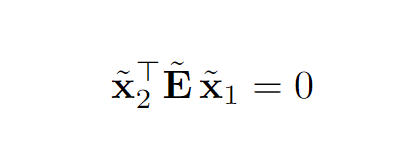

# graphics

## callibration matrix K
关于相机的内部参数矩阵，可以理解为是把以相机为原点，以及相机的轴线构造出的坐标系中的点映射到相机中的像素坐标系的点中去。

举几个例子，首先很显然的，原点的位置需要改变，需要移动到整个画面的左上角，从而使画面中的所有像素的坐标都是正数。还有就是我们在相机中的像素坐标系中描述坐标用的单位长度应该是一颗像素的大小。

*remark*：一个很需要注意的事情是，这个K是不改变对象的z坐标的，可以认为，原来在相机成像平面上的点，经过映射之后，就得到了相机像素坐标系的坐标。反之，相机像素坐标系下的点，经过逆映射之后，得到的是相机成像平面上的点的坐标。

## epipolar geometry
这部分内容需要注意的有以下几点：
1. essential matrix确确实实将x_tilda映射到了另外一个成像平面上的epipolar line上面，这一点可以通过移动原象点在射线上的位置得到（极端情况下移动到了相机的位置）。
2. x1_bar, x1_tilde, x2_bar, x2_tilde所处的坐标系全都不一样。带bar的自然好说，带tilde的则是在以各自的相机为原点的坐标系下的坐标。
3. essential matrix & fundamental matrix 都是rank 2的矩阵。可以这么理解，依赖于E或者F，我们将左相机下的点和右相机下的点通过一个方程组联系起来了，即如下图所示

如果E是满秩的话，那么我们发现给定x1，对应的x2只能是0，但是如果E是rank 2的话，给定x1，对应的x2在一条直线上移动，这是符合事实的。

## triangulation

这个地方我们要注意的是，如果你直接去把叉乘变换成矩阵相乘的话，那是没办法得到他这个式子的。事实上，这个式子是通过在前面多乘一个矩阵，交换了结果的第一行和第一列，并且去掉了第三列。因为叉乘矩阵实际上秩为2，并且结果反正各分量都是0，所以没问题。

## orthographic factorization
注意这里面的W矩阵中，那些u v向量都是世界系下的向量。

注意这个地方，一开始看的时候可能很迷惑为什么W是RX的乘积，但是rank会变成满秩。实际上是这样，W是我们直接从相机成像平面上观察出来的，如果没有noise的话，那确实等于RX乘积。

