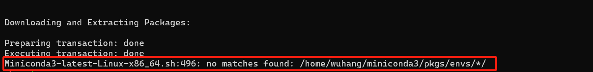

# 服务器上配置miniconda

> 服务器os版本：ubuntu 18.04
>
> shell: zsh
>
> 注意！！！这篇文章完全是个对配环境外行的人写的，可能完全有问题，通篇都是错误也有可能

众所周知啊，python是个对版本非常严格的脚本语言，不像大多数语言新版本能兼容旧版本，python（以及很多包）的新版本和旧版本常常是不兼容的，那么版本管理就很重要。这也就是anaconda/miniconda的作用。但是如果我们的conda版本太低的话，下载高版本的包也是会出问题的啊。我初次在实验室服务器上下载的miniconda版本是4.x，但是现在其实已经到了24.x了，显然我的版本太低了。

于是我打算删除miniconda重新安装，这时候我觉得miniconda一个很让人难受的事情就出现了，没有相应的卸载器。所以我第一次删除，就直接单纯地删除了系统下的miniconda3目录，然后wget了新版本的miniconda下载脚本。尝试运行，出现了非常神奇的错误。

很搞笑，我都还没安装好你，你急着去找我未来要用你创建的envs干嘛呢？

遇到这个我首先就是怀疑是不是没删干净上个远古版本的miniconda，听起来很有道理，因为我是用远古版本的miniconda创建过一些环境，并且删除他的目录之前没有跑`conda remove ...`这种指令删除他们，所以我的环境的记录可能是存留在某些类似奇怪的conda文件夹里面。然后我的新版本miniconda就先读取了这些奇怪的文件，然后去尝试寻找这些包。于是我赶紧把机器里面和conda相关的文件夹都删了（指`.conda`和 `.condarc`，也包括`.zshrc`里面conda环境配置的一些内容），然后重新跑了安装脚本——还是寄了！

这下我觉得事情逐渐逆天了，为了深入了解这个问题的根源，我用vscode打开了这个安装脚本，查看他在496行的源码。发现他这个操作跟我之前删没删干净没关系，似乎他无论如何就是要把里面的envs重新下载一遍（？我其实也不是很确定），那么按理来说里面要是没东西的话你就跳过这个操作就行了啊。结果询问gpt得知，zsh这个shell，如果查找类似`/envs/*/`的东西（主要是路径带这个`*`的），要是没找到的话，似乎是会报错的。于是我就改用bash跑了这个安装脚本，总算是好嘞。但是很奇怪的是我用bash跑的脚本，`conda init`执行完之后居然是`.zshrc`中的配置被修改，`.bashrc`中反而找不到conda相关的内容。我大为震惊，但是反正我也懒得探索了。

到这，问题算解决了——其实没有。。我发现我们实验室服务器的空间资源是真的紧缺啊。我要下载的依赖只有5个G不到，但是已经是完全装不下了。所以我就只好再把miniconda移动到其他有空闲位置的文件夹里面。（这一段经历也很坎坷！！我由于不敢再装一次，就尝试了只移动文件夹，然后修改`.zshrc`中的内容，期待他们适配，但是特么，完全失败了，而且中间还经历了修改conda的环境变量后conda命令仍然寻找原来的路径下的bin目录的情况，真的是给我整的怀疑人生了。所以最后还是删了重新装了。